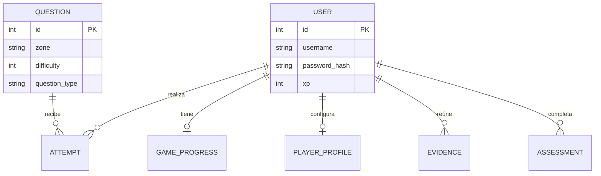
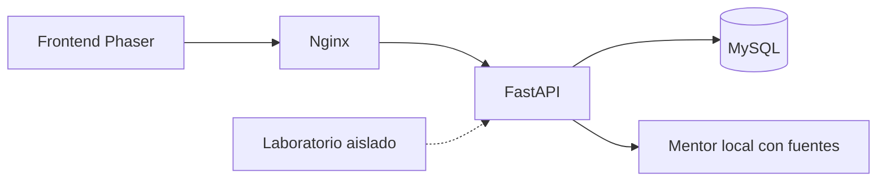
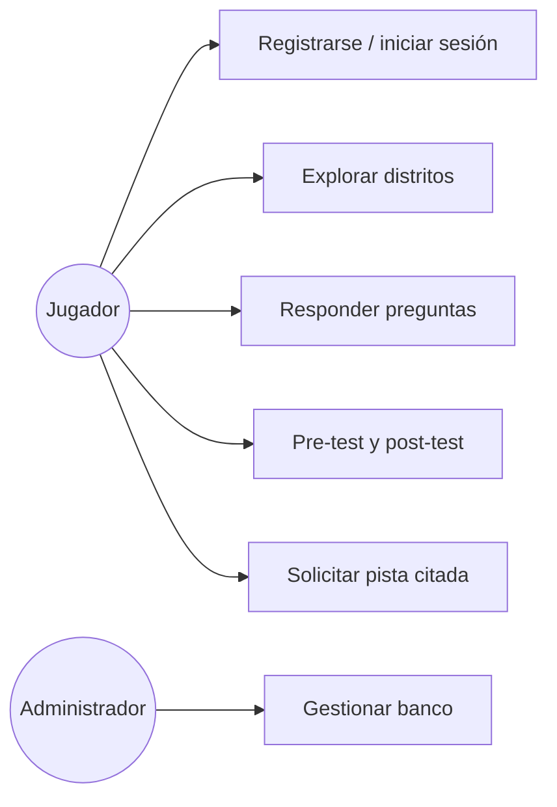
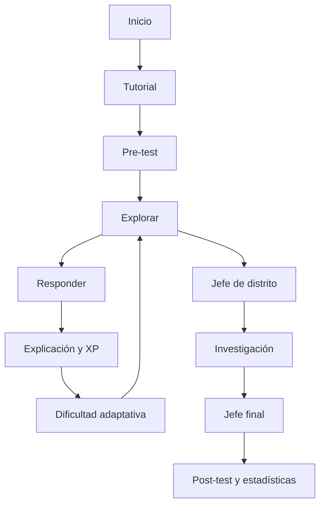

# Diagramas para la defensa

## Entidad-relación

```mermaid
erDiagram
  USER ||--o{ ATTEMPT : realiza
  QUESTION ||--o{ ATTEMPT : recibe
  USER ||--o| GAME_PROGRESS : tiene
  USER ||--o| PLAYER_PROFILE : configura
  USER ||--o{ EVIDENCE : reúne
  USER ||--o{ ASSESSMENT : completa
  USER {
    int id PK
    string username
    string password_hash
    int xp
  }
  QUESTION {
    int id PK
    string zone
    int difficulty
    string question_type
  }
```

## Arquitectura

```mermaid
flowchart LR
  Browser[Frontend Phaser] --> Nginx[Nginx]
  Nginx --> API[FastAPI]
  API --> DB[(MySQL)]
  API --> Mentor[Mentor local con fuentes]
  Lab[Laboratorio aislado] -.-> API
```

## Casos de uso

```mermaid
flowchart LR
  Player((Jugador)) --> Register[Registrarse / iniciar sesión]
  Player --> Explore[Explorar distritos]
  Player --> Quiz[Responder preguntas]
  Player --> Assess[Pre-test y post-test]
  Player --> Mentor[Solicitar pista citada]
  Admin((Administrador)) --> Manage[Gestionar banco]
```

## Flujo del juego

```mermaid
flowchart TD
  Start[Inicio] --> Tutorial[Tutorial]
  Tutorial --> Pre[Pre-test]
  Pre --> Explore[Explorar]
  Explore --> Answer[Responder]
  Answer --> Feedback[Explicación y XP]
  Feedback --> Adaptive[Dificultad adaptativa]
  Adaptive --> Explore
  Explore --> Boss[Jefe de distrito]
  Boss --> Detective[Investigación]
  Detective --> Final[Jefe final]
  Final --> Post[Post-test y estadísticas]
```
